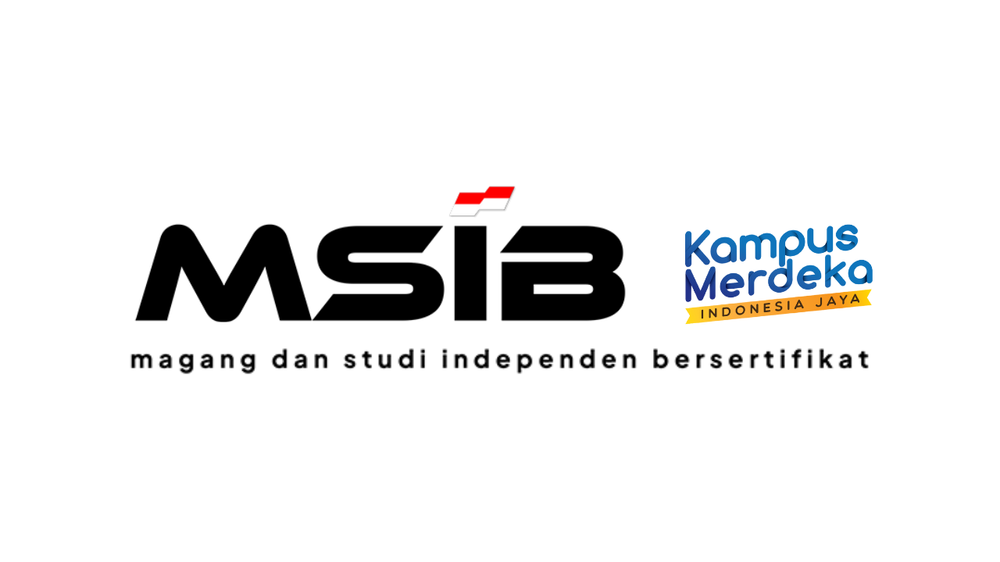
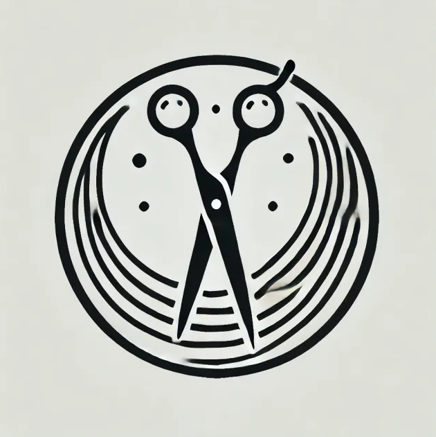
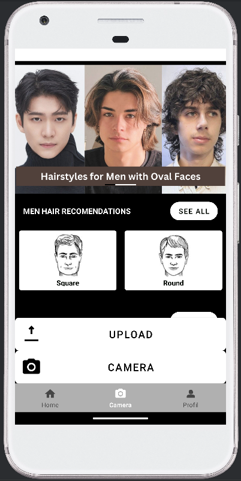
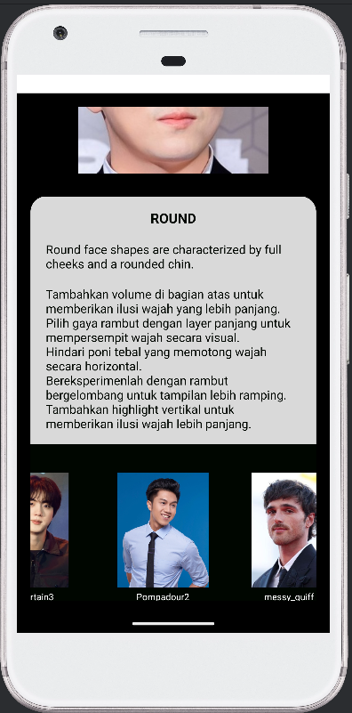

  
  

#   HairMuse App 

## 📝 Project Overview
Repositories for Bangkit 2024 Batch 2 Capstone Project

   
More Information

  ### 💡 About HairMuse

HairMuse is an innovative mobile application that revolutionizes personal styling through artificial intelligence. By leveraging advanced machine learning technologies, the app provides personalized  hairstyle recommendations based on individual face shapes.

   Download Now!
    
   

## Screenshots
  
  
  
  
  

## 🚀 Key Features

- **AI-Powered Face Shape Detection**
  - Accurately identifies face shapes: Oval, Heart, Oblong, Square, and Round
  - Uses cutting-edge machine learning algorithms

- **Personalized Styling Recommendations**
  - Tailored hairstyle suggestions based on unique facial characteristics
  - Boosts user confidence and self-expression

- **User-Friendly Interface**
  - Simple image upload process
  - Instant hairstyle recommendations

## 🤖 Technology Stack

- **Machine Learning**
  - Face Shape Classification
  - ResNet50 Neural Network
  - TensorFlow
  - Python

- **Mobile Development**
  - Android Native Development
  - Kotlin/Java

- **Cloud Computing**
  - Cloud infrastructure
  - Backend services

## 🧑‍🤝‍🧑 Meet the Team (C242-PS317)

### Team Members:

  
| Learning Path | Bangkit ID | Name | University |
|:-------------:|:----------:|:-----:|:-----------:|
| Machine Learning | M172B4KY0625 | Ariandi Galuh | Universitas Mikroskil |
| Machine Learning | M319B4KY1435 | Fathur Rahman | Universitas Sumatera Utara |
| Machine Learning | M319B4KY1380 | Fakhri Djamaris | Universitas Sumatera Utara |
| Cloud Computing | C172B4KY1182 | Dominikus Zamili | Universitas Mikroskil |
| Cloud Computing | C390B4KY4538 | Yohandres Segono | Universitas Prima Indonesia |
| Mobile Development | A319B4KY1361 | Faisal Akbar | Universitas Sumatera Utara |
| Mobile Development | A390B4KX4127 | Sharon Kristin Lubis | Universitas Prima Indonesia |

### 🌈 Bangkit 2024 Theme
**Fusion Unleashed: Art Entertainment and Media Transformation**

## 🎯 Project Objectives

- Develop an AI-driven hairstyle recommendation system
- Create a user-friendly mobile application
- Demonstrate the potential of machine learning in personal styling
- Provide accessible and convenient styling advice

## 🔍 How It Works

1. **Upload Image**: User uploads a clear, front-facing photo
2. **Face Analysis**: Detects and classifies face shape automatically when the analyze button is pressed
3. **Recommendation**: Personalized hairstyle suggestions generated
4. **Explore & Choose**: Users browse recommended styles

## 📦 Repositories

- **Machine Learning**: [[ML Repo Link](https://github.com/HairMuseApp/HairMuseApp-ML)]
- **Mobile Development**: [[Mobile App Repo Link](https://github.com/HairMuseApp/HairMuse-MD)]
- **API**: [[API Repo Link](https://github.com/HairMuseApp/HairMuse-API)]

 C242-PS317 Teams

